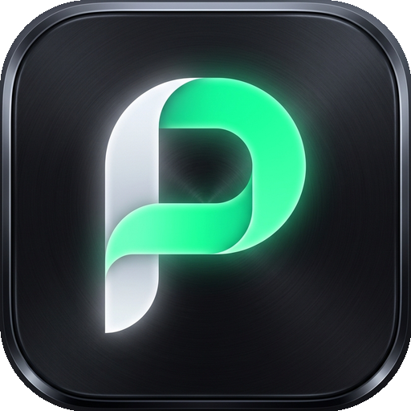

<p align="center">
  
</p>

<h1 align="center">Plik (พลิก)</h1>

<p align="center">
  <strong>Intelligent Thai-English Keyboard Switcher & Auto-Corrector for Windows</strong><br>
  <em>พลิกภาษา พลิกคำผิด ในพริบตา</em>
</p>

<p align="center">
  <a href="https://github.com/NoppalitP/plik/actions"></a>
  <a href="https://github.com/NoppalitP/plik/releases"></a>
  <a href="LICENSE"></a>
  <a href="https://www.python.org/"></a>
  <a href="#"></a>
</p>

---

## ⚡ Highlights (จุดเด่น)

* **🚀 Cascaded Hybrid Architecture (CHA):**
  * **511,076-Word Dual Lexicon**: ฐานคำศัพท์ไทย 137,006 คำ + อังกฤษ 374,070 คำ ค้นหาคำผิดความเร็วแสง $O(1) < 0.05\ \mu\text{s}$
  * **Continuous Thai Typing**: รองรับการพิมพ์ภาษาไทยต่อเนื่องแบบไม่เว้นวรรค เช่น `แนะนำให้ใส่ถุง`
* **✨ Instant Auto-Correction (แก้คำผิดอัตโนมัติ):**
  * **ไทย**: แก้คำผิดยอดฮิตกว่า 150+ คำทันที (`นะค่ะ` $\rightarrow$ `นะคะ`, `กระเพรา` $\rightarrow$ `กะเพรา`, `สังเกตุ` $\rightarrow$ `สังเกต`, `อนุญาติ` $\rightarrow$ `อนุญาต`, `โอกาศ` $\rightarrow$ `โอกาส`, `เซ็นต์ชื่อ` $\rightarrow$ `เซ็นชื่อ` ฯลฯ)
  * **อังกฤษ**: แก้คำผิดกว่า 100+ คำพร้อมรักษารูปพิมพ์เล็ก-ใหญ่ (`teh` $\rightarrow$ `the`, `Teh` $\rightarrow$ `The`, `TEH` $\rightarrow$ `THE`, `recieve` $\rightarrow$ `receive`)
* **🛡️ Developer Tool Immunity (ปลอดภัยสำหรับโปรแกรมเมอร์):**
  * ไม่แตะต้องโค้ดหรือชื่อตัวแปรเมื่อพิมพ์ใน **VS Code (`code.exe`), Terminals, Command Prompt, PowerShell หรือ IDEs**
* **↩️ Instant Undo (ย้อนคืนค่าทันที):**
  * หากระบบแปลงคำแล้วคุณต้องการคำเดิมจริง ๆ เพียงกด **Backspace 1 ครั้ง** ระบบจะคืนค่าเดิมทันที
* **🔒 100% Offline & Private (ปลอดภัยสูงสุด):**
  * **ไม่มีการเชื่อมต่ออินเทอร์เน็ตแม้แต่ไบต์เดียว** ไม่เก็บประวัติการพิมพ์ ไม่มีความเสี่ยงต่อการรั่วไหลของรหัสผ่านหรือข้อมูลส่วนตัว
* **🪶 Ultra Lightweight:**
  * ใช้แรมเฉลี่ยเพียง **~30-33 MB** ทำงานเงียบสนิทบน System Tray โดยไม่มีหน้าต่างคอนโซลกวนใจ

---

## 💡 Real-World Impact (ตัวอย่างสถานการณ์จริงที่สร้างความแตกต่าง)

| สถานการณ์จริง (Real Scenario) | สิ่งที่เผลอพิมพ์ (Raw Mistake) | ผลลัพธ์หลัง Plik พลิกให้ (0ms) | คุณค่า & Impact ที่ได้รับ |
|---|---|---|---|
| 💬 **แชตด่วนกับลูกค้า/ทีมงาน**<br>*(LINE, Slack, Teams)* | `l;ylfu[ =vrefi'kydy[.` | **สวัสดีครับ ขอปรึกษาครับ** | ⚡ **ประหยัด Backspace 23 ครั้ง (~6 วินาที)**<br>การสนทนาไม่สะดุด ไม่ต้องลบประโยคยาวพิมพ์ใหม่ |
| 👔 **อีเมลและเอกสารทางการ**<br>*(Executive Credibility)* | `ขอบคุณนะค่ะ ที่ให้โอกาศ` | **ขอบคุณนะคะ ที่ให้โอกาส** | 💼 **รักษาภาพลักษณ์มืออาชีพ 100%**<br>ไม่เสียเครดิตจากคำผิดที่คนมักสะกดผิดบ่อย |
| 📝 **พิมพ์งานต่อเนื่องไม่มองจอ**<br>*(Deep Focus & Flow State)* | `cotoe.shlts5x5'wfhsoydy[.` | **แนะนำให้ใส่ถุงได้หน่อยครับ** | 🧠 **ไม่หลุดสมาธิ (Flow State)**<br>CHA Engine ถอดรหัสคำไทยติดกันอย่างแม่นยำ |
| 🛡️ **เขียนโค้ดและรัน Terminal**<br>*(DevOps & Production Safety)* | `git push origin main --force` | `git push origin main --force` | 🛑 **ป้องกันคำสั่งพัง 100%**<br>Code Guard ละเว้นคำสั่ง CLI และโค้ด ไม่แปลงจนเสียหาย |
| ⏱️ **จดสรุปประชุมด่วน**<br>*(Speed & Productivity)* | `dkifu[bf;y;0y'w,jruf[8njv` | **การทำงานยังไม่คืบหน้า** | 📈 **ได้เวลาคืนกว่า 30 ชั่วโมงต่อปี**<br>พิมพ์รัวๆ ได้อย่างมั่นใจ ถนอมสวิตช์คีย์บอร์ดและข้อมือ |

---

## ⚖️ Comparison (ตารางเปรียบเทียบกับเครื่องมืออื่น)

| ฟังก์ชันการทำงาน | 🚀 Plik (พลิก) | 🔄 RightLang / โปรแกรมยุคก่อน | 🪟 Windows เดิมๆ |
|---|:---:|:---:|:---:|
| **การสลับคำผิดอัตโนมัติ** | **ทันทีที่เคาะ Space (0ms)** | ช้า หรือต้องกดคีย์ลัดสั่ง | ❌ ไม่มี (ต้องกดลบพิมพ์ใหม่) |
| **Code Guard (คุ้มครองคำสั่งโค้ด)** | ✅ **มี (ละเว้นคำสั่ง Git, CLI, ไฟล์โค้ด)** | ❌ ไม่มี (มักแปลงโค้ดเสียหาย) | ❌ ไม่มี |
| **แก้ไขคำผิดในตัว (Typo Engine)** | ✅ **มี (แก้ทั้งคำผิดไทยและอังกฤษ)** | ❌ ไม่มี | ❌ ไม่มี |
| **สถาปัตยกรรมความปลอดภัย (Privacy)** | ✅ **100% Offline (Zero Network)** | ⚠️ บางโปรแกรมต่อเน็ตเวิร์ก | ✅ ทำงานในเครื่อง |
| **การใช้ทรัพยากรเครื่อง (RAM)** | ✅ **เบามาก (~30 MB)** | ⚠️ 80 - 150 MB | ✅ เล็กน้อย |
| **ความเข้ากันได้กับ Windows 11** | ✅ **Native Win32 Hook 64-bit** | ⚠️ ปิดการพัฒนา / มักติดขัด | ✅ มาตรฐาน |
| **Single-Instance Mutex** | ✅ **มี (ป้องกันเปิดโปรแกรมซ้อน)** | ❌ ไม่มี (เปิดซ้ำจนคีย์ค้าง) | — |
| **Instant Undo (กดย้อนคืนค่าทันที)** | ✅ **กด Backspace 1 ครั้ง คืนค่าเดิม** | ❌ ต้องลบพิมพ์ใหม่ทั้งหมด | — |
| **Open Source & ปรับแต่งได้** | ✅ **MIT License ตรวจสอบโค้ดได้** | ❌ Closed Source | ❌ Closed Source |

---

## 📥 Download & Installation (ดาวน์โหลดและติดตั้ง)

### วิธีที่ 1: One-Click Setup Installer (แนะนำสำหรับผู้ใช้ทั่วไป)
1. ไปที่หน้า [Releases](https://github.com/NoppalitP/plik/releases)
2. ดาวน์โหลด **`Plik_Setup_v1.0.exe`**
3. ดับเบิลคลิกเพื่อติดตั้ง (ไม่ต้องใช้สิทธิ์ Administrator)
4. โปรแกรมจะสร้าง Shortcut บน Desktop/Start Menu และเริ่มทำงานบน System Tray ทันที

### วิธีที่ 2: Portable Executable (ไม่ต้องติดตั้ง)
1. ดาวน์โหลด **`Plik.exe`**
2. วางไว้ในโฟลเดอร์ที่คุณต้องการ แล้วดับเบิลคลิกเปิดใช้งานได้ทันที

---

## 🎮 Controls & Shortcuts (การควบคุมและปุ่มลัด)

| การกระทำ | ปุ่ม / วิธีการ | คำอธิบาย |
|---|---|---|
| **Pause / Resume** | กดปุ่ม `Pause / Break` | พักการทำงานชั่วคราว หรือเปิดกลับมาทำงาน |
| **Instant Undo** | กดปุ่ม `Backspace` | ย้อนคืนข้อความเดิมทันทีหากเพิ่งถูกแปลง |
| **Tray Context Menu** | คลิกขวาที่ไอคอน **P** | เปิดเมนูตั้งค่า, สลับโหมดแก้คำผิด, ปิดโปรแกรม |

---

## 🏗️ Architecture Overview

```
[Keystroke via WH_KEYBOARD_LL]
              │
              ▼
    [Syntax & Dev Guard] ──(Protected?)──► [PASS UNTOUCHED]
              │ No
              ▼
   [Auto-Correct Engine] ──(Match Typo?)──► [REPLACE IN-FLIGHT]
              │ No
              ▼
     [Tier 0: CHA Lexicon] ──(Found?)──► [ATOMIC SendInput REPLACEMENT]
              │ No
              ▼
  [Phonotactics & N-gram] ──(Confidence > 0.85?)──► [CONVERT LAYOUT]
```

---

## 💻 Development & Building from Source

### Prerequisites
* Windows 10 / 11 (64-bit)
* Python 3.10+ (แนะนำ 3.13)

### Quick Start
```powershell
# Clone the repository
git clone https://github.com/NoppalitP/plik.git
cd plik

# Create virtual environment
python -m venv .venv
.\.venv\Scripts\Activate.ps1

# Install in editable mode with dev dependencies
pip install -e ".[dev]"

# Run full test suite (52 tests)
pytest -v

# Run the Tray Application
python -m plik.tray_app
```

### Building Standalone Binary & Installer
```powershell
# Compile single-file executable with PyInstaller
pyinstaller --clean -y Plik.spec

# Compile Inno Setup Installer (requires Inno Setup 6+)
& "C:\Program Files (x86)\Inno Setup 6\ISCC.exe" installer\Plik_Setup.iss
```

---

## 📄 License

Distributed under the **MIT License**. See [`LICENSE`](LICENSE) for more information.
